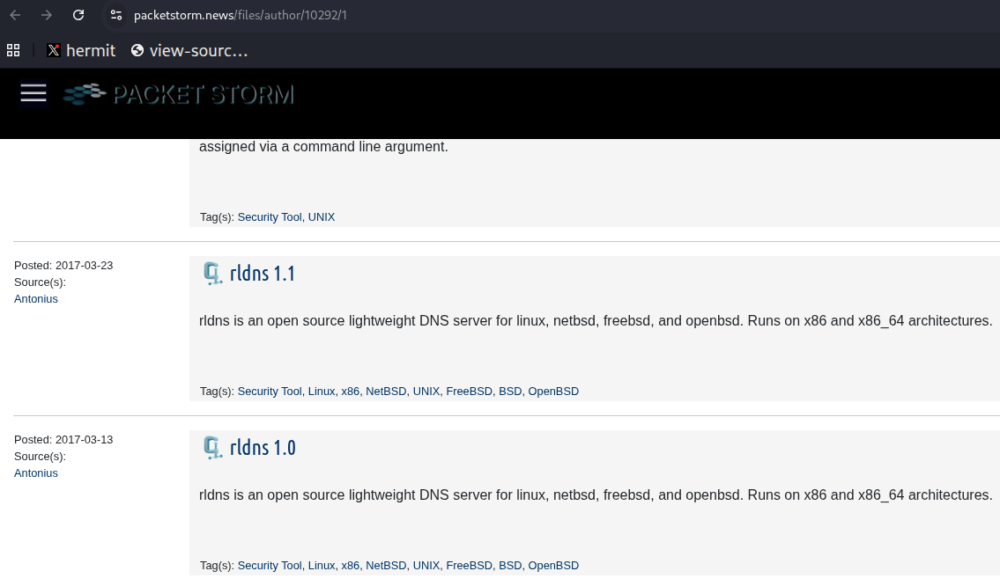

# rldns 1.4

**rldns** is an open-source, lightweight DNS server for Unix-like operating systems. It was developed by **Antonius (w1sdom)** and is maintained as part of the BlueDragonSec / Indodev ecosystem.

<p align="center">
  
</p>

## Overview

rldns is designed to be a minimal and easy-to-configure DNS server with support for common DNS record types and simple DNS-based load balancing.

**Current version:** `rldns 1.4`  
**Release date:** February 2026  
**Developed by:** Antonius (w1sdom)  
**Websites:**

- [BlueDragonSec](https://www.bluedragonsec.com)
- [Indodev](https://indodev.asia)

## Supported Platforms

rldns supports the following operating systems and architectures:

| Category | Supported Targets |
|---|---|
| Operating systems | Linux, NetBSD, FreeBSD, OpenBSD |
| Architectures | x86, x86_64 |

## Features

- A record support
- CNAME record support
- MX record support
- NS record support
- Lightweight and minimalist design
- Easy installation
- Flexible configuration
- DNS load balancing support
- Security review and fuzzing work using honggfuzz

## Installation

To build and install rldns from source, run:

```bash
./configure
make
sudo make install
```

After installation, the default configuration file is located at:

```text
/usr/local/rldns/rldns.conf
```

## Download

You can download rldns from the following locations:

- [rldns SourceForge](https://rldns.sourceforge.net)
- [GitHub Repository](https://github.com/bluedragonsecurity/rldns)
- [Indodev Download Mirror](https://indodev.asia/downloads/rldns-1.4.tar.bz2)
- [BlueDragonSec Download Mirror](https://www.bluedragonsec.com/files/rldns-1.4.tar.bz2)

Older versions are available here:

- [rldns Archives](https://github.com/bluedragonsecurity/rldns_archives)

## Patch Notes for rldns 1.4

- Fixed 9 heap-based out-of-bounds read issues.
- Added validation after `recvfrom()`.
- Fuzzed using honggfuzz.

## Configuration

The main configuration file is:

```text
/usr/local/rldns/rldns.conf
```

### Configuration Directives

| Directive | Description |
|---|---|
| `port` | Specifies the DNS server port. |
| `worker` | Specifies how many workers rldns should use. |
| `version` | Defines the rldns version string. |
| `zones` | Specifies the path pattern for zone files. Zone files should be placed inside the rldns directory. |
| `dns1` | Specifies the first upstream DNS server used when no local record is found. |
| `dns2` | Specifies the second upstream DNS server used when no local record is found. |
| `resolvertype` | Determines the A-record resolver behavior. Resolver type `2` is recommended for better DNS-based load balancing. |

### Example `rldns.conf`

```ini
; default rldns configuration file
; recommended setting: 2 or 3 workers

port 53
worker 1
version "RLDNS-1.4"

; all zone files must be inside the zones directory
zones zones/*.zone

dns1 8.8.4.4
dns2 8.8.8.8

; A-name resolver type can be 1 or 2
;
; Resolver Type 1:
; If more than one IP address exists for an A-name request,
; rldns performs DNS-based load balancing without randomizing the IP sequence.
;
; Resolver Type 2:
; If more than one IP address exists for an A-name request,
; rldns randomizes the IP sequence for DNS-based load balancing.
;
; Default: 2
; Recommended: 2

resolvertype 2
```

## Zone Files

Each domain should have its own zone file located in:

```text
/usr/local/rldns/zones
```

A zone file must use the `.zone` extension.

Example:

```text
example1.com.zone
```

### Master Zone Format

Every zone file should start with the `masterzone` directive followed by the domain name.

```text
masterzone <domain name>
```

Example:

```text
masterzone example1.com
```

## DNS Record Formats

### A Record

```text
Arecord <ip address>
```

Example:

```text
Arecord 192.168.1.10
```

The maximum number of A records for each domain is `18`.

### CNAME Record

```text
CNAMErecord <name>
```

Example:

```text
CNAMErecord www
```

### MX Record

```text
MXrecord <name>
```

Example:

```text
MXrecord smtp
```

### NS Record

```text
NSrecord <name>
```

or:

```text
NSrecord <name> <ip address>
```

Examples:

```text
NSrecord ns1
NSrecord ns1 192.168.1.1
```

## Example Zone File

Save the following example as:

```text
/usr/local/rldns/zones/example1.com.zone
```

```ini
; example1.com testing zone file for rldns daemon

masterzone example1.com

; you can provide up to 18 A records
Arecord 10.10.0.1
Arecord 10.10.1.2
Arecord 192.168.1.2
Arecord 192.168.2.2
Arecord 192.168.2.3
Arecord 172.10.10.1
Arecord 208.79.92.177
Arecord 208.79.92.178
Arecord 208.79.92.179
Arecord 208.79.92.180
Arecord 208.79.92.181
Arecord 208.79.92.182
Arecord 208.79.92.183
Arecord 208.79.92.184
Arecord 208.79.92.185
Arecord 208.79.92.186

CNAMErecord www
CNAMErecord blog
CNAMErecord mail

MXrecord smtp

NSrecord ns1 192.168.1.1
NSrecord ns2 192.168.1.2
NSrecord ns3 192.168.1.3
NSrecord ns4 192.168.1.4
```

## Running rldns

After installation and configuration, run:

```bash
/usr/local/rldns/rldns
```

If rldns is configured to listen on port `53`, you may need elevated privileges depending on your operating system configuration.

## Project History

rldns has been developed by Antonius since 2017. Version `1.4` is the next maintained release of the rldns server and was released in February 2026.

## Copyright

Copyright © Indodev. All rights reserved.

Developed by **Antonius (w1sdom)**.
